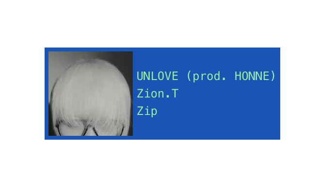

# Last.fm Widget

A simple _almost_ 'plug-n-play' [last.fm](https://last.fm) recently playing widget created with Web Components.



## Usage

1. Edit the values for the Username to fetch from and your last.fm api key in the script (get it from [here](https://www.last.fm/api/account/create)).

```js
class LastFmWidget extends HTMLElement {
  // Constants
  #USERNAME = '<enter your last.fm username here>'; // Change this
  #API_KEY = '<enter your last.fm api key here>'; // and this
```

2. (Optional) Change the fallback image url for cover arts.

```js
#FALLBACK_IMG = 'https://lastfm.freetls.fastly.net/i/u/64s/c6f59c1e5e7240a4c0d427abd71f3dbb.jpg'; // Change this
```

3. (Optional) Change the CSS for the widget. This is the html structure of different states of the widget for reference.

```html
<!-- Widget with Track Info -->
<div class="wrapper">
    
    <div class="track info">
        <p>A Banger Track</p>
        <p>Some Talented Artist</p>
        <p>Album of the Year</p>
    </div>
</div>

<!-- Widget with Loading State -->
<div class="wrapper">
  <p class="loading">loading...</p>
</div>

<!-- Widget with Error -->
<div class="wrapper">
  <p class="error">Relevant Error Message</p>
</div>

```

3. import the script in your html.

```html
<script type="module" src="/widget.js"></script>
```
## Attributes

|      Name      |  Type   | Default | Description |
|      :--:      |  :--:   | :-----: | :---------: |
| `auto-update`  | Boolean | `false` | Should thew widget refetch current song after a set interval |
| `polling-rate` | Number  |  `15`   | time between refetches (in seconds) |


## Variants

1. Simple

```
<last-fm-widget></last-fm-widget>
```

2. Auto-Updating

```
<last-fm-widget auto-update></last-fm-widget>
```

3. Auto Updaing with custom Polling Rate.

```
<last-fm-widget auto-update polling-rate="30"></last-fm-widget>
```

---

Web Components are kinda cool, ngl.
